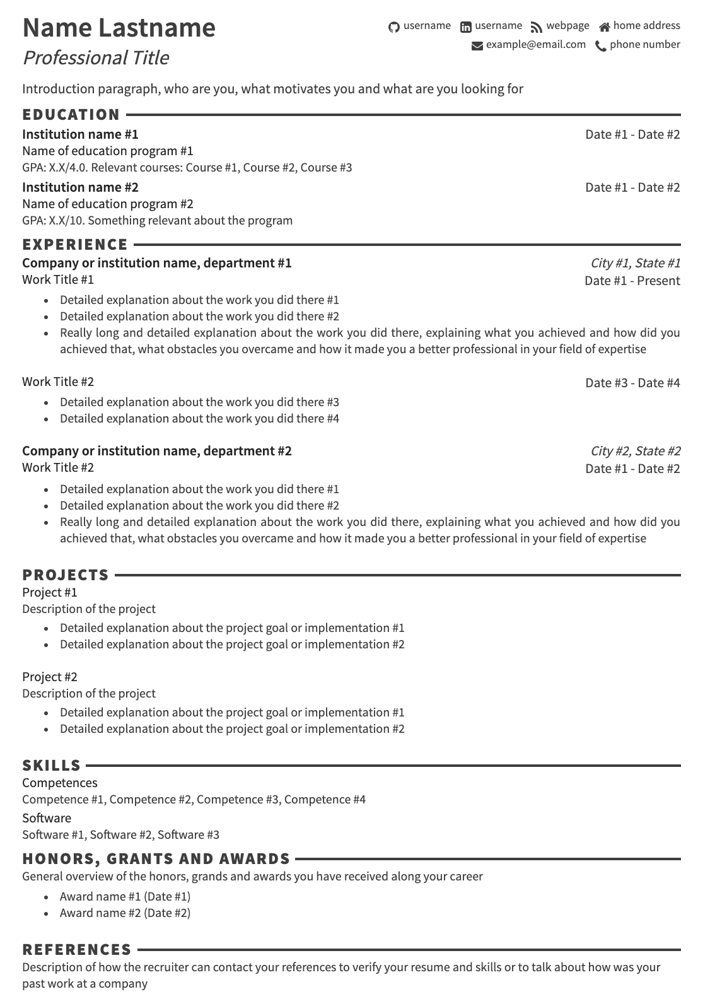

# Resume Generator

Generate elegant resumes from a single YAML data file.
Export them to HTML, JSON, Markdown, PDF, Text and XML.

Prerequisite
----
* [Docker](https://docs.docker.com/install/)

Run
----
* Make sure your data file is named `resume.yaml`, in the project's root folder (use `example.yaml` as a starting point).
* Generate the resume by executing
```
docker run --rm -v $(pwd):/app -w /app celfring/resume-generator -resume=resume.yaml
```
This will output your resume files to `$(pwd)/output`

Examples
----
* [Original YAML](example.yaml)
* [Generated HTML](output/example.html)
* [Generated JSON](output/example.json)
* [Generated Markdown](output/example.md)
* [Generated PDF](output/example.pdf)
* [Generated Text](output/example.txt)
* [Generated XML](output/example.xml)

Screenshot


License
----
[MIT](LICENSE) - Feel free to use and edit.

Tech
----
* [The Go Programming Language](https://golang.org/)
  * [go-yaml](https://github.com/go-yaml/yaml) - yaml parsing package
  * [gorilla-websocket](https://github.com/gorilla/websocket) - web sockets
* [Imagemagick](https://www.imagemagick.org/) - PDF to PNG converter
* [Font Awesome](https://fortawesome.github.io/Font-Awesome) - icons
* [Docker](https://docs.docker.com/install/)
